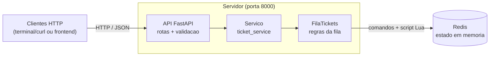

# support-ticket-hub

> **Entrega 3 — Interface Gráfica e Concorrência** | Sistemas Distribuídos — CIn UFPE

Sistema distribuído de fila de chamados de suporte técnico.

## Enunciado

[Equipe 13] — Sistema de Tickets de Suporte Técnico (Sugestão: Sockets / BullMQ com
Redis / RabbitMQ ou equivalente)
● Modelar a fila sequencial de chamados em memória em ordem de prioridade de chegada (FIFO), com campos: {ticket_id, usuario, descricao, status, timestamp_abertura}.
● Definir o design do protocolo textual separando permissões: perfil Usuário (pode abrir chamado) e perfil Técnico (pode consumir/fechar chamado).
● Escrever as validações conceituais de exclusividade: garantir que um chamado marcado como "em atendimento" não possa ser atribuído a um segundo técnico simultaneamente.
● Configurar a escuta TCP/fila com o framework escolhido (BullMQ+Redis, RabbitMQ ou equivalente) e testar o enfileiramento básico de uma mensagem.
● Documentar no README: estrutura da fila, diferenciação de perfis, tecnologia escolhida e justificativa.

## Tecnologias escolhidas

- **FastAPI**: servidor da aplicação e endpoints HTTP.
- **Redis**: armazenamento da fila de chamados.
- **Docker Compose**: execução dos serviços.
- **Frontend Web em HTML, CSS e JavaScript puro**: na Entrega 3, a interface gráfica é o meio
  principal de interação com o sistema. Duas telas dedicadas — `usuario.html` e `tecnico.html`
  — substituem os comandos de terminal como canal de demonstração oficial, com push em tempo
  real via SSE e contadores de status atualizados automaticamente.

## Justificativa tecnológica

A entrega pede um servidor rodando com um framework (não mais socket puro), um estado central
em memória e validações de formato. Cada escolha abaixo foi pensada pra encaixar nessas peças.

**FastAPI.** É um framework web de Python, então já cumpre o "não usar socket puro". A gente
escolheu ele porque define as rotas de forma enxuta e tipada, e a validação de entrada vem de
graça junto, pelo Pydantic. Isso atende direto o requisito de validações básicas de formato:
declarar que `usuario` e `descricao` são obrigatórios já faz o servidor recusar entrada inválida.
Além disso o FastAPI gera sozinho a documentação interativa (Swagger, em `/docs`), o que ajuda a
equipe a enxergar e testar o protocolo sem precisar de outra ferramenta. Como o time já trabalha
com Python, a curva de aprendizado é curta.

**Redis.** O ponto central da entrega é guardar o estado em memória, e o Redis é justamente um
banco em memória, então ele *é* esse estado central. O que pesou bastante é que as estruturas
dele casam com o nosso modelo sem precisar inventar nada: uma List dá a fila FIFO (`RPUSH` pra
entrar no fim, `LPOP` pra sair do começo), um Hash guarda os dados de cada chamado e Sets servem
de índice por status. E o mais importante: ele executa scripts Lua de forma atômica, o que
resolve a exclusividade exigida (dois técnicos nunca pegam o mesmo chamado) sem a gente ter que
implementar trava na mão. A sugestão do enunciado era BullMQ, que é do mundo Node; como o backend
é Python, usar o Redis direto entrega a mesma fila de um jeito mais simples pra nós.

**Docker Compose.** Sobe o backend e o Redis juntos com um comando só, sempre na porta fixada
(8000) e igual na máquina de todo mundo do grupo. Isso evita o clássico "na minha máquina
funciona" e ainda facilita rodar os testes dentro do container.

**Frontend em HTML, CSS e JavaScript puro.** As telas são um complemento visual e não participam
da comprovação obrigatória da Entrega 2. Não é necessário um framework de frontend nesta fase:
os comandos principais são demonstrados por HTTP no terminal, enquanto o backend permanece
desacoplado de qualquer interface.

## Arquitetura

O sistema é dividido entre clientes HTTP, servidor da aplicação e Redis. Os clientes podem ser
comandos `curl` no terminal ou o frontend opcional; nenhum deles acessa o Redis diretamente.
Quem traduz uma requisição em operações na fila é o backend, organizado em camadas.



### Elementos

- **Clientes HTTP**: comandos no terminal são a forma principal de demonstração. As telas em
  HTML/CSS/JS exercitam o mesmo contrato como complemento opcional.
- **API FastAPI (porta 8000)**: é a porta de entrada. Recebe as requisições, valida o formato
  com Pydantic, separa os perfis (quais rotas o usuário e o técnico usam) e responde em JSON.
  Sobe na porta fixa 8000, com `/health` para teste e `/docs` com a documentação automática.
  As funções de rota síncronas são executadas pelo FastAPI/Starlette em uma thread pool, então
  múltiplas requisições HTTP podem ser atendidas concorrentemente sem conexão persistente.
- **Camada de serviço (`ticket_service`)**: fica entre as rotas e a fila. As rotas não mexem
  no Redis direto, elas chamam o serviço, que chama a fila. Isso mantém a API desacoplada da
  implementação do armazenamento.
- **Fila (`FilaTickets`, em `queue/redis_queue.py`)**: onde mora a lógica da fila. Faz
  abrir/listar/pegar/fechar traduzindo para operações no Redis, garante a ordem FIFO e a
  exclusividade (um chamado nunca vai para dois técnicos) através de um script Lua atômico.
- **Redis**: o estado central em memória. Guarda a fila numa List, os dados de cada chamado
  num Hash e índices por status em Sets.

### Fluxo de uma requisição

- **Abrir** (usuário): `POST /tickets` → serviço → `FilaTickets.abrir` → o chamado entra no
  fim da fila (`RPUSH`) e seus dados vão para um Hash, com status `OPEN`.
- **Pegar** (técnico): `PATCH /tickets/next` → `FilaTickets.pegar` → um script Lua faz o
  `LPOP` e marca como `IN_PROGRESS` numa operação só, então dois técnicos nunca pegam o mesmo.
- **Fechar** (técnico): `PATCH /tickets/{id}/close` → `FilaTickets.fechar` → o chamado vira
  `CLOSED`.

O detalhamento da fila, dos perfis, do protocolo e da estratégia de concorrência está nas
seções abaixo.

## Como rodar

### Com Docker (mais fácil)

Com Docker e Docker Compose instalados, na raiz do projeto:

```bash
docker compose down --remove-orphans
docker compose up --build
```

O primeiro comando é útil para uma validação do zero; ele remove containers e redes anteriores
do projeto. O segundo constrói e sobe Redis e backend juntos. A API fica na porta fixa **8000**:
dá pra testar em `http://127.0.0.1:8000/health` e ver todos os endpoints em
`http://127.0.0.1:8000/docs`.
Para parar, use `docker compose down`.

### Sem Docker

Também dá pra rodar o backend direto, num ambiente virtual. Nesse caso é preciso ter um Redis
no ar, porque a API conecta nele assim que inicia (a forma mais simples é subir só o Redis com
`docker compose up -d redis`).

No Linux ou macOS:

```bash
cd backend
python3 -m venv .venv
source .venv/bin/activate
pip install -r requirements.txt
uvicorn app.main:app --reload
```

No Windows (PowerShell):

```powershell
cd backend
python -m venv .venv
.venv\Scripts\Activate.ps1
pip install -r requirements.txt
uvicorn app.main:app --reload
```

O servidor sobe em `http://127.0.0.1:8000`, com `/health` para teste e `/docs` com a
documentação interativa.

## Entrega 2 — Comunicação e Core

Nesta entrega a comunicação é **HTTP concorrente**, sem conexão persistente. Cada
requisição representa a interação de um cliente e registra seu IP nos logs. O FastAPI atende
requisições simultâneas, enquanto o Redis centraliza o estado em memória e o script Lua protege
a retirada exclusiva dos tickets.

### Teste de concorrência

Para testar a concorrência com HTTP + Redis, suba o projeto com Docker Compose na raiz do
repositório:

```bash
docker compose up --build
```

Com a API rodando, execute o teste de carga em outro terminal. A forma abaixo usa as dependências
que já estão instaladas no container:

```bash
docker compose exec backend python scripts/load_test.py \
  --base-url http://127.0.0.1:8000 \
  --tickets 50 \
  --technicians 10
```

Resultado real da validação final:

```text
=== Teste de concorrencia HTTP + Redis ===
API: http://127.0.0.1:8000
Tickets solicitados para criacao: 50
Tecnicos concorrentes: 10

Resumo:
- Tickets criados: 50/50
- Requisicoes de consumo feitas por tecnicos: 60
- Tickets atribuidos: 50
- Respostas de fila vazia: 10
- Duplicidade de ticket_id: NAO
- Tickets abertos ao final (GET /tickets): 0
- Tempo total de execucao: 0.57s

Status final: SUCESSO
```

O teste cria vários chamados simultaneamente usando `POST /tickets` e depois simula vários
técnicos consumindo a fila em paralelo com `PATCH /tickets/next`. No final, consulta
`GET /tickets` e verifica se nenhum `ticket_id` foi entregue para dois técnicos diferentes.
Se a API não estiver no ar, o script mostra uma mensagem orientando a rodar
`docker compose up --build`, sem despejar traceback desnecessário.

### Logs operacionais

O backend escreve os logs da aplicação no console em formato JSON, com um evento por linha.
Toda requisição HTTP registra `timestamp`, nível, método, rota, IP do cliente, código de status e
tempo de resposta em milissegundos. Exceções inesperadas também são registradas com o evento
`http_request_failed` antes de serem tratadas pelo servidor.

As operações principais da fila geram os seguintes eventos:

| Evento | Nível | Situação |
|---|---|---|
| `ticket_created` | `INFO` | usuário abriu e enfileirou um chamado |
| `ticket_assigned` | `INFO` | técnico retirou o próximo chamado da fila |
| `ticket_closed` | `INFO` | chamado em atendimento foi fechado |
| `empty_queue` | `WARNING` | técnico tentou consumir uma fila vazia |
| `invalid_ticket_close` | `WARNING` | tentativa de fechar ticket inexistente ou fora de atendimento |

Os logs aparecem diretamente no terminal usado para subir a aplicação:

```bash
docker compose up --build
```

Também é possível acompanhá-los em outro terminal:

```bash
docker compose logs -f backend
```

O teste de carga da seção anterior gera várias linhas de criação, atribuição, fila vazia e
requisições concorrentes. Trecho real capturado no console durante a validação com Docker:

```json
{"timestamp":"2026-06-21T21:19:57.278507+00:00","level":"INFO","logger":"support_ticket_hub.app.services.ticket_service","event":"ticket_created","ticket_id":"c9a37990-2f47-4e54-ba45-18f607db921b","usuario":"usuario-demo"}
{"timestamp":"2026-06-21T21:20:05.179085+00:00","level":"INFO","logger":"support_ticket_hub.app.services.ticket_service","event":"ticket_assigned","ticket_id":"c9a37990-2f47-4e54-ba45-18f607db921b","tecnico":"tecnico-demo"}
{"timestamp":"2026-06-21T21:19:44.254193+00:00","level":"WARNING","logger":"support_ticket_hub.app.services.ticket_service","event":"empty_queue","tecnico":"tecnico-load-008"}
{"timestamp":"2026-06-21T21:20:10.966333+00:00","level":"INFO","logger":"support_ticket_hub.app.services.ticket_service","event":"ticket_closed","ticket_id":"c9a37990-2f47-4e54-ba45-18f607db921b"}
```

### Demonstração via terminal

Os comandos abaixo podem ser executados em Bash ou Git Bash com a API no ar.

1. O usuário abre um chamado:

```bash
curl -sS -X POST http://127.0.0.1:8000/tickets \
  -H "Content-Type: application/json" \
  -d '{"usuario":"usuario-demo","descricao":"Notebook nao liga"}'
```

Resposta real (`201 Created`):

```json
{"ticket_id":"c9a37990-2f47-4e54-ba45-18f607db921b","usuario":"usuario-demo","descricao":"Notebook nao liga","status":"OPEN","timestamp_abertura":"2026-06-21T21:19:57.277927+00:00","tecnico":"","timestamp_atendimento":"","timestamp_fechamento":""}
```

2. O técnico consome o próximo chamado da fila:

```bash
curl -sS -X PATCH http://127.0.0.1:8000/tickets/next \
  -H "Content-Type: application/json" \
  -d '{"tecnico":"tecnico-demo"}'
```

Resposta real (`200 OK`), com o mesmo ticket em atendimento:

```json
{"ticket_id":"c9a37990-2f47-4e54-ba45-18f607db921b","usuario":"usuario-demo","descricao":"Notebook nao liga","status":"IN_PROGRESS","timestamp_abertura":"2026-06-21T21:19:57.277927+00:00","tecnico":"tecnico-demo","timestamp_atendimento":"2026-06-21T21:20:05.178560+00:00","timestamp_fechamento":""}
```

3. O técnico fecha o chamado usando o `ticket_id` retornado:

```bash
curl -sS -X PATCH \
  http://127.0.0.1:8000/tickets/c9a37990-2f47-4e54-ba45-18f607db921b/close
```

Resposta real (`200 OK`):

```json
{"ticket_id":"c9a37990-2f47-4e54-ba45-18f607db921b","status":"CLOSED"}
```

## Como abrir as interfaces

Na Entrega 3, a **interface gráfica é o meio principal de interação** com o sistema. Desenvolvemos duas interfaces web distintas e separadas para o gerenciamento de chamados:

- **`usuario.html`**: Destinada ao perfil do Usuário para abrir novos chamados e acompanhar o andamento da fila ao vivo.
- **`tecnico.html`**: Destinada ao perfil do Técnico para visualizar os chamados abertos na fila, capturar o próximo chamado pendente e fechar os chamados que estão em atendimento.

Para rodar e visualizar as interfaces locais no seu navegador, sirva a pasta `frontend` como um site estático executando o comando abaixo no terminal:

```bash
cd frontend && python -m http.server 3000
```
Após iniciar o servidor estático, acesse as URLs correspondentes em abas separadas do navegador:

Portal do Cliente: http://localhost:3000/usuario.html

Painel do Técnico: http://localhost:3000/tecnico.html

## Push em tempo real (SSE)
O sistema utiliza a tecnologia Server-Sent Events (SSE) para estabelecer uma conexão contínua entre o servidor e os clientes conectados:

Atualização Automatizada: Cada vez que um ticket é criado por um usuário, atribuído a um profissional ou encerrado, o servidor FastAPI empurra automaticamente um evento de atualização para todas as interfaces web abertas simultaneamente.

Indicador de Conexão: O indicador visual verde posicionado ao lado da fila de chamados confirma em tempo real que a comunicação SSE com o backend está ativa e operacional.

Dashboard de Indicadores: Na tela do técnico, os contadores numéricos de chamados Pendentes, Em Atendimento e Encerrados são atualizados de forma instantânea e transparente, eliminando qualquer necessidade de recarregar a página manualmente (zero polling).

## Simulando dois técnicos disputando o mesmo ticket
Para testar visualmente o mecanismo de concorrência atômica e a garantia de exclusividade implementada através de scripts Lua no Redis, siga o passo a passo de simulação abaixo:

Abra duas abas distintas do seu navegador, posicionando-as lado a lado, ambas acessando a interface do técnico em http://localhost:3000/tecnico.html.

Na Aba 1, insira no campo de identificação o ID **tech_01**. Na Aba 2, preencha o campo com o ID **tech_02**.

Abra uma terceira aba acessando o portal do cliente em http://localhost:3000/usuario.html e crie um novo chamado de suporte. Graças ao Push via SSE, o chamado aparecerá imediatamente nas duas abas abertas dos técnicos.

Clique no botão "Pegar Próximo Chamado" nas duas abas de técnicos exatamente ao mesmo tempo.

**Resultado esperado (passo 5):** O Redis decide atomicamente qual dos dois técnicos recebe o chamado — não importa qual, pois o `LPOP` e o `HSET status=IN_PROGRESS` são executados dentro de um único script Lua, sem nenhuma janela de tempo entre eles. O que você verá nas telas:

- **Aba vencedora**: o chamado aparece imediatamente na seção "Chamados em Atendimento", com o ID do técnico correto e o botão "Fechar Chamado" disponível.
- **Aba que perdeu**: exibe a mensagem **"Nenhum chamado pendente na fila."** — prova de que o Redis já havia entregado o único ticket existente para o outro técnico antes de processar esta requisição.
- **Ambas as abas**: os contadores de *Pendentes* e *Em Atendimento* no topo da tela se atualizam automaticamente via SSE, sem qualquer reload de página, confirmando que o estado da fila foi propagado para todos os clientes conectados em tempo real.

Essa demonstração visual é o equivalente gráfico do teste automático `test_dois_tecnicos_nao_recebem_o_mesmo_ticket` que usa `Barrier + ThreadPoolExecutor` para forçar a disputa simultânea.

## Demonstração visual 

Os prints abaixo são complementares à demonstração de terminal e foram tirados com backend e
Redis no Docker e o frontend servido localmente.

### Painel do Usuário — abertura e acompanhamento ao vivo


Na interface `usuario.html`, o cliente informa o nome e a descrição do problema para abrir o chamado (`POST /tickets`). A seção inferior **Meus Chamados** lista os tickets solicitados e sincroniza suas mudanças de status instantaneamente (*Aguardando*, *Em atendimento* ou *Encerrado*) através da escuta contínua de eventos SSE emitidos pelo backend, evidenciada pelo indicador verde *Ao vivo*.

### Painel do Técnico — fila de chamados pendentes


Quando novos chamados são abertos, eles surgem instantaneamente na tabela **Fila de Chamados Abertos** em ordem cronológica de chegada (FIFO), incrementando o contador de *Pendentes*. Ao clicar no botão azul **Pegar Próximo Chamado**, o servidor executa o script Lua atômico no Redis (`PATCH /tickets/next`), garantindo a exclusividade da atribuição.

### Painel do Técnico — visão inicial e contadores em tempo real


O painel `tecnico.html` centraliza a operação de suporte apresentando cards numéricos dinâmicos no topo (*Pendentes*, *Em Atendimento* e *Encerrados*) que refletem o estado global da fila no Redis. O indicador verde ao lado do formulário confirma a conexão ativa via Server-Sent Events (SSE). Quando não há chamados, o sistema exibe mensagens de feedback claras na tabela.

### Painel do Técnico — atendimento exclusivo e encerramento


Após a atribuição bem-sucedida, o chamado sai da fila geral e vira um card exclusivo na seção **Chamados em Atendimento**, associado ao ID do profissional. Ao concluir o suporte, o clique no botão vermelho **Fechar Chamado** (`PATCH /tickets/{id}/close`) encerra o ciclo, atualizando os contadores em todas as telas conectadas sem recarregar a página.

### Documentação automática da API (Swagger UI)


Gerada automaticamente pelo FastAPI em `http://localhost:8000/docs`, a interface interativa lista todos os endpoints REST (`/tickets`, `/events`, `/health`) e seus esquemas de dados Pydantic (`TicketCreate`, `TicketAssign`, `TicketResponse`), permitindo testar diretamente o protocolo e verificar as respostas HTTP.


## Estrutura de pastas

```
support-ticket-hub/
├── backend/              # API FastAPI + fila no Redis
│   ├── app/
│   │   ├── main.py       # sobe o servidor e registra as rotas
│   │   ├── api/          # rotas HTTP (tickets.py e o novo events.py para SSE)
│   │   ├── schemas/      # validação de entrada/saída (Pydantic)
│   │   ├── services/     # camada entre as rotas e a fila
│   │   ├── queue/        # FilaTickets, implementação em cima do Redis
│   │   └── core/         # configuração do sistema e broadcaster.py (mecanismo SSE)
│   ├── tests/            # testes automatizados da aplicação
│   ├── Dockerfile
│   └── requirements.txt
├── frontend/             # interfaces gráficas em HTML, CSS e JS puro
├── docs/
│   ├── img/              # prints das telas do sistema
│   ├── Contrato.md       # protocolo HTTP e especificações de eventos SSE
│   └── Arquitetura.md    # documentação técnica das decisões estruturais
├── docker-compose.yml
└── README.md             # Instruções de uso e documentação do projeto
```

## Validações básicas

A entrada é validada já na borda da API, pelos schemas do Pydantic em `backend/app/schemas`.
`usuario` e `descricao` são obrigatórios e não podem ser vazios nem só espaços (passam por
`strip()`). Se o corpo da requisição vier errado, o servidor responde `422` apontando o campo.
Além disso, fechar um chamado só funciona se ele estiver em atendimento, senão retorna erro.

## Estrutura da fila no Redis

A fila é guardada inteiramente no Redis. A ordem de chegada (FIFO) é mantida por uma
lista, e cada chamado em si fica num hash separado. Além disso temos dois sets que
funcionam como índice para saber rapidamente quais tickets estão em atendimento ou já
fechados. Os campos exigidos pelo enunciado (`ticket_id`, `usuario`, `descricao`,
`status`, `timestamp_abertura`) ficam todos no hash do ticket.

| Chave | Tipo | Função |
|---|---|---|
| `tickets:pending` | List | Fila FIFO com os ticket_ids aguardando atendimento, na ordem de chegada |
| `ticket:<id>` | Hash | Dados do chamado (ticket_id, usuario, descricao, status, timestamp_abertura, etc.) |
| `tickets:in_progress` | Set | Índice dos chamados que algum técnico já pegou |
| `tickets:closed` | Set | Índice dos chamados encerrados |

O status de um chamado passa por três valores ao longo da vida dele: `OPEN` (acabou de
ser aberto e está na fila), `IN_PROGRESS` (um técnico pegou) e `CLOSED` (foi fechado).

## Perfis e permissões

Separamos quem pode fazer o quê em dois perfis. O **Usuário** só consegue abrir chamado.
O **Técnico** é quem consome a fila: pega o próximo da vez e depois fecha. Listar os
chamados abertos qualquer um pode fazer, já que é só leitura.

| Perfil | O que pode fazer |
|---|---|
| Usuário | Abrir chamado (`POST /tickets`) |
| Técnico | Pegar o próximo da fila (`PATCH /tickets/next`) e fechar um chamado (`PATCH /tickets/{id}/close`) |
| Qualquer | Listar os chamados abertos (`GET /tickets`) |

## Estratégia de concorrência

O ponto mais delicado é garantir que dois técnicos não peguem o mesmo chamado ao mesmo
tempo. Para isso o método `pegar` não faz a retirada em vários passos no Python, e sim
através de um script Lua que roda dentro do próprio Redis. Enquanto esse script executa,
o Redis não deixa nenhuma outra operação acontecer, então a sequência "tira o primeiro
da fila e marca como em atendimento" vira uma coisa indivisível. Mesmo que duas
requisições cheguem no mesmo instante, uma vai pegar o chamado e a outra vai pegar o
próximo (ou nenhum, se a fila esvaziar).

## Protocolo de comunicação

A comunicação é toda por HTTP, trocando JSON nos dois sentidos. O servidor sobe na porta 8000,
então a base das URLs é `http://127.0.0.1:8000`. A separação de perfis aparece no protocolo: o
usuário só abre chamado e o técnico consome a fila (pega e fecha).

### Formato do chamado (TicketResponse)

Toda resposta que devolve um chamado usa o mesmo formato:

| Campo | Descrição |
|---|---|
| `ticket_id` | identificador único do chamado (gerado pelo servidor) |
| `usuario` | quem abriu |
| `descricao` | texto do problema |
| `status` | `OPEN`, `IN_PROGRESS` ou `CLOSED` |
| `timestamp_abertura` | data/hora de abertura (ISO 8601, UTC) |
| `tecnico` | técnico que pegou (vazio enquanto ninguém pegou) |
| `timestamp_atendimento` | quando o técnico pegou (vazio antes disso) |
| `timestamp_fechamento` | quando foi fechado (vazio antes disso) |

### Rotas

**`POST /tickets`** — abrir chamado (perfil Usuário)

Corpo: `{ "usuario": "joao", "descricao": "Notebook nao liga" }`

Resposta `201 Created` com o ticket recém-criado (status `OPEN`). Os dois campos são
obrigatórios; o servidor faz `strip()` e recusa string vazia ou só com espaços (responde `422`
apontando o campo).

```json
{
  "ticket_id": "8f3c1b2a-...",
  "usuario": "joao",
  "descricao": "Notebook nao liga",
  "status": "OPEN",
  "timestamp_abertura": "2026-06-14T18:20:00+00:00",
  "tecnico": "",
  "timestamp_atendimento": "",
  "timestamp_fechamento": ""
}
```

**`GET /tickets`** — listar chamados abertos (qualquer perfil)

Resposta `200 OK` com a lista de chamados em status `OPEN`, na ordem de chegada. Se não houver
nenhum, devolve `[]`.

**`PATCH /tickets/next`** — pegar o próximo (perfil Técnico)

Corpo: `{ "tecnico": "maria" }`

Pega o primeiro da fila, marca como `IN_PROGRESS` e devolve `200 OK` com o ticket. Se a fila
estiver vazia, responde `404 Not Found`. Essa é a operação crítica da exclusividade: a retirada é
atômica no Redis (script Lua), então dois técnicos nunca recebem o mesmo chamado.

**`PATCH /tickets/{ticket_id}/close`** — fechar (perfil Técnico)

Fecha um chamado que está em atendimento. Resposta `200 OK`:

```json
{ "ticket_id": "8f3c1b2a-...", "status": "CLOSED" }
```

Se o ticket não existir ou não estiver em atendimento, responde `400 Bad Request`.

**`GET /health`** — serve só para testar se o servidor está no ar. Responde `{ "status": "ok" }`.

Os comandos completos e as respostas capturadas estão na seção
[Demonstração via terminal](#demonstração-via-terminal).

### Códigos de resposta

| Situação | Código |
|---|---|
| Chamado aberto com sucesso | 201 |
| Listagem, pegar ou fechar com sucesso | 200 |
| Fila vazia ao tentar pegar o próximo | 404 |
| Fechar um ticket inexistente ou que não está em atendimento | 400 |
| Corpo inválido (campo obrigatório faltando ou vazio) | 422 |

## Testes

A suíte automatizada fica em `backend/tests` e utiliza o `pytest` com `pytest-asyncio` para validar a aplicação de ponta a ponta em 42 cenários:

- **`test_fila.py` (Regras de Negócio e Concorrência):** valida abertura com timestamps ISO 8601 em UTC, rejeição de campos vazios, ordem de consumo FIFO, transições de estado (`OPEN` → `IN_PROGRESS` → `CLOSED`), retornos para fila vazia ou chamados inexistentes e exclusividade atômica (testada sob estresse com `threading.Barrier` e `ThreadPoolExecutor`).
- **`test_api.py` (Endpoints e Contratos HTTP):** cobre todas as rotas REST (`/tickets`, `/tickets/next`, `/tickets/{id}/close`, `/tickets/stats`, `/tickets/status/{status}`), validando schemas Pydantic, códigos de retorno (`200`, `201`, `400`, `404`, `422`), fluxos E2E e disputas concorrentes simuladas com clientes assíncronos (`AsyncClient`).
- **`test_sse.py` (Push em Tempo Real):** testa o gerador de eventos (`_event_generator`), o envio de comentários de `keepalive` para evitar timeout e garante que o `broadcaster` publica os payloads corretos (`ticket_created`, `ticket_assigned`, `ticket_closed`) após cada alteração no Redis.
- **`test_logging.py` (Observabilidade):** valida que os logs estruturados são emitidos em formato JSON rigoroso com todos os campos de auditoria de requisição HTTP e operações da fila.

Os testes de integração se conectam dinamicamente ao Redis quando disponível; se o banco estiver indisponível, os testes dependentes são ignorados graciosamente.

Com o stack do Docker no ar:

```bash
docker compose exec backend python -m pytest -v
```

Ou localmente, com o ambiente virtual ativado e um Redis rodando:

```bash
cd backend
python -m pytest -v
```

Resultado real da validação final:

```text
collected 42 items
============================== 42 passed in 0.97s ==============================
```

O teste concorrente de exclusividade atômica também foi repetido sob estresse em múltiplos threads e clientes assíncronos, garantindo 100% de isolamento e zero duplicação de tickets.

