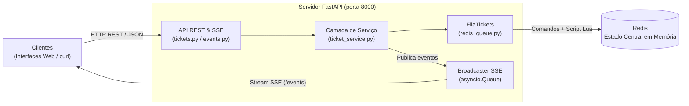
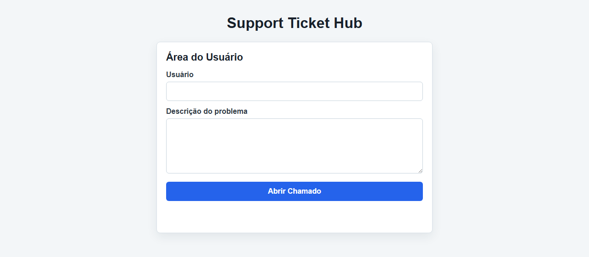
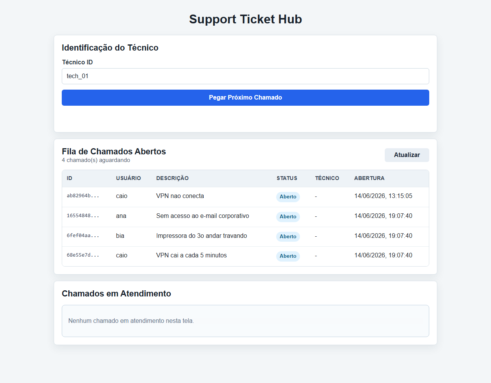
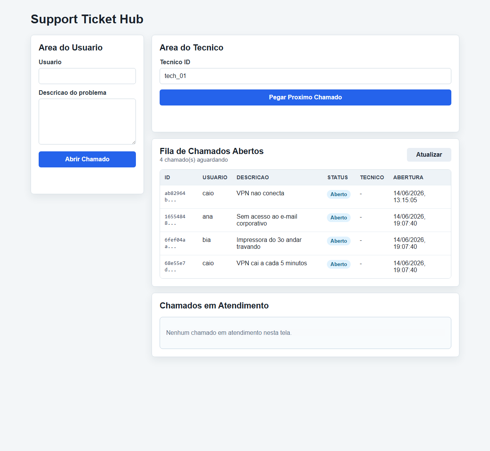
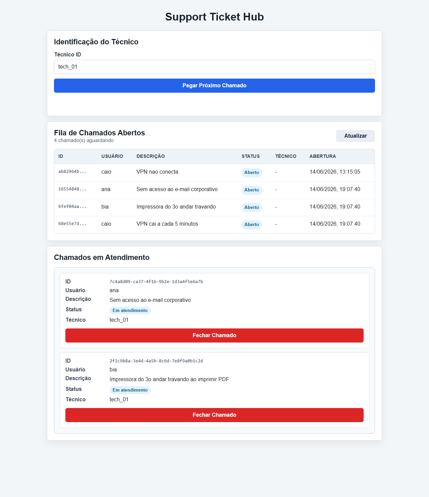
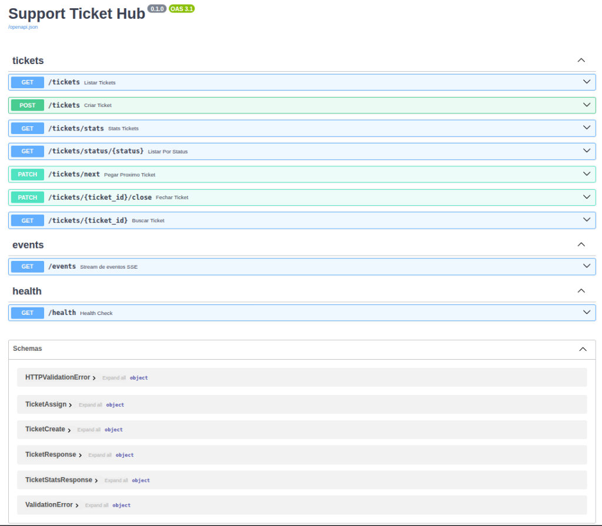

# support-ticket-hub

> **Entrega 3 — Interface Gráfica e Concorrência** | Sistemas Distribuídos — CIn UFPE

Sistema distribuído de fila de chamados de suporte técnico com push em tempo real e concorrência atômica.

## Enunciado

[Equipe 13] — Sistema de Tickets de Suporte Técnico (Sugestão: Sockets / BullMQ com
Redis / RabbitMQ ou equivalente)
● Modelar a fila sequencial de chamados em memória em ordem de prioridade de chegada (FIFO), com campos: {ticket_id, usuario, descricao, status, timestamp_abertura}.
● Definir o design do protocolo textual separando permissões: perfil Usuário (pode abrir chamado) e perfil Técnico (pode consumir/fechar chamado).
● Escrever as validações conceituais de exclusividade: garantir que um chamado marcado como "em atendimento" não possa ser atribuído a um segundo técnico simultaneamente.
● Configurar a escuta TCP/fila com o framework escolhido (BullMQ+Redis, RabbitMQ ou equivalente) e testar o enfileiramento básico de uma mensagem.
● Documentar no README: estrutura da fila, diferenciação de perfis, tecnologia escolhida e justificativa.

## Tecnologias escolhidas

- **FastAPI**: servidor da aplicação, validação de schemas Pydantic e endpoints HTTP/SSE.
- **Redis**: armazenamento da fila em memória e execução de scripts Lua atômicos.
- **Docker Compose**: orquestração e execução isolada dos serviços.
- **Frontend Web em HTML, CSS e JavaScript puro**: na Entrega 3, a interface gráfica é o canal principal de operação do sistema. Duas telas dedicadas — `usuario.html` e `tecnico.html` — interagem via REST e recebem atualizações instantâneas via Server-Sent Events (SSE), mantendo contadores e listas sincronizados sem recarregar a página.

## Justificativa tecnológica

A arquitetura do projeto foi projetada para atender aos requisitos de sistemas distribuídos unindo simplicidade operacional, tipagem rigorosa e alta tolerância a falhas na concorrência.

**FastAPI.** Atende à exigência de um servidor robusto sobre protocolo padronizado (substituindo sockets crus). A tipagem nativa integrada ao Pydantic garante validação automática na borda: requisições com campos obrigatórios ausentes ou em branco são rejeitadas com erro HTTP `422` antes de atingir a lógica de negócio. Além disso, o suporte nativo a geradores assíncronos facilita a implementação do streaming de eventos em tempo real (SSE) na rota `/events`, enquanto a documentação Swagger em `/docs` permite testar todos os contratos visualmente.

**Redis.** Funciona como o estado central em memória compartilhado entre todas as requisições. Suas estruturas nativas mapeiam perfeitamente o domínio: uma List (`RPUSH`/`LPOP`) implementa a fila FIFO, Hashes armazenam os metadados dos chamados e Sets indexam os status. O fator decisivo para a escolha do Redis é seu motor de scripts Lua: ele garante que a leitura e a mutação de estado ocorram de forma 100% atômica dentro do servidor, resolvendo o problema de exclusividade (evitando condições de corrida onde dois técnicos pegariam o mesmo ticket) sem travas de software complexas.

**Docker Compose.** Padroniza o ambiente de execução, subindo a API na porta fixa `8000` e o banco Redis em rede isolada com um único comando, eliminando inconsistências entre as máquinas da equipe.

**Frontend Vanilla (HTML/CSS/JS puro).** A escolha de não utilizar frameworks pesados de frontend (como React ou Angular) mantém a arquitetura limpa, leve e de fácil auditoria. Através de requisições `fetch` assíncronas e da API nativa `EventSource`, o cliente se conecta ao backend para atualizações em tempo real (SSE) com mínimo consumo de recursos.

## Arquitetura

O sistema adota uma arquitetura em camadas desacopladas. O frontend comunica-se via HTTP REST para mutações e escuta um canal SSE unidirecional para propagação de eventos.



### Elementos

- **Clientes**: Interfaces web (`usuario.html` e `tecnico.html`) ou clientes de terminal (`curl`).
- **API FastAPI (porta 8000)**: Recebe requisições, valida payloads via Pydantic e gerencia as rotas REST em `api/tickets.py` e o endpoint de streaming em `api/events.py`. As rotas síncronas rodam em thread pool, garantindo alta vazão.
- **Camada de Serviço (`ticket_service.py`)**: Intermedia as rotas HTTP e a persistência, aplicando regras de negócio e disparando notificações para o mecanismo de broadcast quando o estado muda.
- **Fila (`FilaTickets`, em `queue/redis_queue.py`)**: Abstração do Redis que implementa as operações FIFO e executa o script Lua atômico para atribuição exclusiva.
- **Broadcaster (`core/broadcaster.py`)**: Gerencia o hub de filas assíncronas (`asyncio.Queue`) dos clientes conectados ao SSE. Utiliza `loop.call_soon_threadsafe` para cruzar de forma segura a fronteira entre as threads de trabalho REST e o event loop assíncrono.
- **Redis**: Armazena as chaves da fila (`tickets:pending`), hashes dos chamados (`ticket:<id>`) e sets de controle (`tickets:in_progress`, `tickets:closed`).

### Fluxo de requisição e eventos em tempo real

- **Abrir Chamado** (Usuário): `POST /tickets` → `ticket_service.abrir()` → `RPUSH` no Redis + `HSET` (status `OPEN`) → Serviço publica evento `ticket_created` no Broadcaster → Broadcaster empurra JSON via SSE (`GET /events`) para todas as abas.
- **Pegar Chamado** (Técnico): `PATCH /tickets/next` → `ticket_service.pegar()` → Script Lua atômico roda no Redis (`LPOP` + `HSET` status `IN_PROGRESS`) → Serviço publica evento `ticket_assigned` → Broadcaster envia SSE com contadores e dados atualizados.
- **Fechar Chamado** (Técnico): `PATCH /tickets/{id}/close` → `ticket_service.fechar()` → `HSET` status `CLOSED` + atualização de Sets → Serviço publica evento `ticket_closed` → Clientes SSE atualizam a interface instantaneamente.

## Como rodar

### Com Docker Compose (Recomendado)

Na raiz do projeto, execute:

```bash
docker compose down --remove-orphans
docker compose up --build
```

O backend estará disponível na porta fixa **8000** (`http://localhost:8000/docs` para o Swagger UI) e o Redis rodará em segundo plano.

### Sem Docker (Ambiente Virtual Python)

Com uma instância local do Redis rodando (ex: `docker run -d -p 6379:6379 redis`), execute no Linux/macOS:

```bash
cd backend
python3 -m venv .venv
source .venv/bin/activate
pip install -r requirements.txt
uvicorn app.main:app --reload
```

No Windows (PowerShell):

```powershell
cd backend
python -m venv .venv
.venv\Scripts\Activate.ps1
pip install -r requirements.txt
uvicorn app.main:app --reload
```

## Entrega 2 — Comunicação e Core

A base de comunicação assenta em HTTP REST concorrente associada ao registro de auditoria estruturado no console. O FastAPI processa requisições simultâneas em threads isoladas enquanto o Redis garante a integridade transacional das operações da fila.

### Teste de carga e concorrência

Para validar a ausência de condições de corrida e duplicação sob alta concorrência, execute o script de estresse dentro do container com a aplicação rodando:

```bash
docker compose exec backend python scripts/load_test.py \
  --base-url http://127.0.0.1:8000 \
  --tickets 50 \
  --technicians 10
```

O script dispara 50 aberturas simultâneas e 60 tentativas de consumo concorrente em paralelo. O resultado confirmará 50 atribuições únicas, 10 respostas de fila vazia (`404`) e **zero duplicação de IDs**.

### Logs estruturados operacionais

Cada requisição HTTP e evento de negócio emite um log JSON estruturado no stdout, contendo timestamps UTC precisos e contexto de execução:

| Evento | Nível | Descrição |
|---|---|---|
| `ticket_created` | `INFO` | Chamado aberto e enfileirado com sucesso |
| `ticket_assigned` | `INFO` | Chamado atribuído atomicamente a um técnico |
| `ticket_closed` | `INFO` | Chamado encerrado pelo suporte |
| `empty_queue` | `WARNING` | Tentativa de consumo em fila vazia |
| `invalid_ticket_close` | `WARNING` | Tentativa de fechar chamado inexistente ou fechado |

Para acompanhar os logs ao vivo em terminal dedicado:

```bash
docker compose logs -f backend
```

## Como abrir as interfaces

Desenvolvemos duas interfaces web dedicadas e responsivas que operam como clientes oficiais do sistema:

- **`usuario.html`**: Portal do cliente para abertura de tickets e acompanhamento visual em tempo real na lista "Meus Chamados".
- **`tecnico.html`**: Painel operacional com contadores dinâmicos, fila de espera pendente e gestão de chamados em atendimento.

Para servir a interface localmente, execute no terminal a partir da raiz:

```bash
cd frontend && python -m http.server 3000
```

Acesse no navegador:
- Portal do Usuário: `http://localhost:3000/usuario.html`
- Painel do Técnico: `http://localhost:3000/tecnico.html`

## Push em tempo real (SSE)

O streaming de eventos via Server-Sent Events elimina a necessidade de atualizações manuais ou requisições de polling repetitivas:

- **Conexão Contínua**: Ao abrir a página, o navegador conecta-se a `http://localhost:8000/events`. Um indicador visual verde confirma que o feed está *Ao vivo*.
- **Sincronização Instantânea**: Mutações na fila disparam eventos JSON que atualizam imediatamente as tabelas de chamados e os contadores (*Pendentes*, *Em Atendimento*, *Encerrados*) em todas as telas abertas.

## Simulando dois técnicos disputando o mesmo ticket

Para comprovar a exclusividade atômica (requisito central da disciplina):

1. Abra duas abas lado a lado acessando `http://localhost:3000/tecnico.html`.
2. Identifique a Aba 1 como **tech_01** e a Aba 2 como **tech_02**.
3. Em uma terceira aba (`usuario.html`), abra um único chamado. Ele aparecerá instantaneamente nas duas telas dos técnicos via SSE.
4. Clique em **Pegar Próximo Chamado** em ambas as abas exatamente no mesmo segundo.

**Resultado esperado:** O script Lua atômico no Redis processa apenas a primeira requisição que chegar. A aba vencedora recebe o card em atendimento; a aba perdedora recebe a mensagem de feedback **"Nenhum chamado pendente na fila."** sem gerar inconsistências.

## Demonstração visual 

Os prints abaixo são complementares à demonstração de terminal e foram tirados com backend e
Redis no Docker e o frontend servido localmente.

### Painel do Usuário — abertura e acompanhamento ao vivo



Na interface `usuario.html`, o cliente informa o nome e a descrição do problema para abrir o chamado (`POST /tickets`). A seção inferior **Meus Chamados** lista os tickets solicitados e sincroniza suas mudanças de status instantaneamente (*Aguardando*, *Em atendimento* ou *Encerrado*) através da escuta contínua de eventos SSE emitidos pelo backend, evidenciada pelo indicador verde *Ao vivo*.

### Painel do Técnico — fila de chamados pendentes



Quando novos chamados são abertos, eles surgem instantaneamente na tabela **Fila de Chamados Abertos** em ordem cronológica de chegada (FIFO), incrementando o contador de *Pendentes*. Ao clicar no botão azul **Pegar Próximo Chamado**, o servidor executa o script Lua atômico no Redis (`PATCH /tickets/next`), garantindo a exclusividade da atribuição.

### Painel do Técnico — visão inicial e contadores em tempo real



O painel `tecnico.html` centraliza a operação de suporte apresentando cards numéricos dinâmicos no topo (*Pendentes*, *Em Atendimento* e *Encerrados*) que refletem o estado global da fila no Redis. O indicador verde ao lado do formulário confirma a conexão ativa via Server-Sent Events (SSE). Quando não há chamados, o sistema exibe mensagens de feedback claras na tabela.

### Painel do Técnico — atendimento exclusivo e encerramento



Após a atribuição bem-sucedida, o chamado sai da fila geral e vira um card exclusivo na seção **Chamados em Atendimento**, associado ao ID do profissional. Ao concluir o suporte, o clique no botão vermelho **Fechar Chamado** (`PATCH /tickets/{id}/close`) encerra o ciclo, atualizando os contadores em todas as telas conectadas sem recarregar a página.

### Documentação automática da API (Swagger UI)



Gerada automaticamente pelo FastAPI em `http://localhost:8000/docs`, a interface interativa lista todos os endpoints REST (`/tickets`, `/events`, `/health`) e seus esquemas de dados Pydantic (`TicketCreate`, `TicketAssign`, `TicketResponse`), permitindo testar diretamente o protocolo e verificar as respostas HTTP.


## Estrutura de pastas

```text
support-ticket-hub/
├── backend/                  # Servidor FastAPI + lógica de fila no Redis
│   ├── app/
│   │   ├── main.py           # Instanciação da API, CORS e montagem de rotas
│   │   ├── api/              # Endpoints HTTP REST (tickets.py) e SSE (events.py)
│   │   ├── core/             # Configurações globais, logs e broadcaster.py
│   │   ├── queue/            # FilaTickets e script Lua atômico (redis_queue.py)
│   │   ├── schemas/          # Modelos de validação Pydantic (tickets.py)
│   │   └── services/         # Regras de negócio intermediárias (ticket_service.py)
│   ├── tests/                # Suíte completa de 42 testes automatizados
│   ├── Dockerfile            # Build do container da API
│   └── requirements.txt      # Dependências Python
├── frontend/                 # Interfaces web Vanilla (usuario.html, tecnico.html)
├── docs/                     # Contratos, diagramas e prints de demonstração
├── docker-compose.yml        # Orquestração dos containers (API + Redis)
└── README.md                 # Documentação oficial do sistema
```

## Validações básicas

O Pydantic valida os corpos das requisições REST automaticamente. Campos obrigatórios como `usuario` e `descricao` passam por sanitização (`strip()`) e são rejeitados com HTTP `422` se enviados em branco. O fechamento de um ticket via `PATCH /tickets/{id}/close` valida no Redis se o status atual é estritamente `IN_PROGRESS`, retornando HTTP `400` caso contrário.

## Estrutura da fila no Redis

O estado central é persistido exclusivamente em estruturas nativas do Redis:

| Chave | Tipo | Função |
|---|---|---|
| `tickets:pending` | List | Fila FIFO com IDs dos chamados aguardando atendimento |
| `ticket:<id>` | Hash | Metadados do chamado (usuario, descricao, status, timestamps, tecnico) |
| `tickets:in_progress` | Set | Índice de chamados atribuídos em atendimento |
| `tickets:closed` | Set | Índice de chamados finalizados |

Os status evoluem de forma linear: `OPEN` → `IN_PROGRESS` → `CLOSED`.

## Perfis e permissões

O desenho das rotas reflete a separação rigorosa de papéis do sistema:

| Perfil | Ações permitidas | Rotas REST associadas |
|---|---|---|
| **Usuário** | Abrir chamados e consultar status | `POST /tickets`, `GET /tickets/{id}` |
| **Técnico** | Consumir fila e fechar chamados | `PATCH /tickets/next`, `PATCH /tickets/{id}/close` |
| **Público / UI** | Listagem geral, métricas e feed SSE | `GET /tickets`, `GET /tickets/stats`, `GET /events` |

## Protocolo de comunicação e Rotas

A API REST opera na URL base `http://localhost:8000`. Todas as trocas de dados utilizam payloads JSON devidamente estruturados.

### Rotas disponíveis

- **`POST /tickets`** *(Usuário)*: Cria e enfileira um novo chamado no final da fila (`OPEN`). Retorna `201 Created`.
- **`GET /tickets`** *(Geral)*: Lista todos os chamados abertos aguardando atendimento. Retorna `200 OK`.
- **`GET /tickets/stats`** *(Geral)*: Retorna os contadores consolidados em tempo real (`{"pending": X, "in_progress": Y, "closed": Z}`). Retorna `200 OK`.
- **`GET /tickets/status/{status}`** *(Geral)*: Filtra chamados por status (`OPEN`, `IN_PROGRESS`, `CLOSED`). Retorna `200 OK`.
- **`GET /tickets/{ticket_id}`** *(Geral)*: Busca os metadados de um chamado específico pelo seu ID único. Retorna `200 OK` ou `404 Not Found`.
- **`PATCH /tickets/next`** *(Técnico)*: Retira atomicamente o primeiro chamado da fila, atribuindo-o ao técnico (`IN_PROGRESS`). Retorna `200 OK` ou `404 Not Found` (se fila vazia).
- **`PATCH /tickets/{ticket_id}/close`** *(Técnico)*: Encerra o chamado em atendimento (`CLOSED`). Retorna `200 OK` ou `400 Bad Request`.
- **`GET /events`** *(Geral / SSE)*: Estabelece stream de conexão persistente Server-Sent Events disparando payloads de atualização em tempo real (`ticket_created`, `ticket_assigned`, `ticket_closed`).
- **`GET /health`** *(Monitoramento)*: Health check de disponibilidade do serviço. Retorna `200 OK` (`{"status": "ok"}`).

### Resumo dos códigos HTTP

| Situação | Código HTTP |
|---|---|
| Chamado aberto com sucesso | `201 Created` |
| Listagem, consumo ou fechamento bem-sucedido | `200 OK` |
| Fila vazia ou chamado inexistente | `404 Not Found` |
| Operação inválida (ex: fechar ticket já encerrado) | `400 Bad Request` |
| Payload incorreto ou campo obrigatório em branco | `422 Unprocessable Entity` |

## Testes

A suíte automatizada fica em `backend/tests` e utiliza o `pytest` com `pytest-asyncio` para validar a aplicação de ponta a ponta em 42 cenários:

- **`test_fila.py` (Regras de Negócio e Concorrência):** valida abertura com timestamps ISO 8601 em UTC, rejeição de campos vazios, ordem de consumo FIFO, transições de estado (`OPEN` → `IN_PROGRESS` → `CLOSED`), retornos para fila vazia ou chamados inexistentes e exclusividade atômica (testada sob estresse com `threading.Barrier` e `ThreadPoolExecutor`).
- **`test_api.py` (Endpoints e Contratos HTTP):** cobre todas as rotas REST (`/tickets`, `/tickets/next`, `/tickets/{id}/close`, `/tickets/stats`, `/tickets/status/{status}`), validando schemas Pydantic, códigos de retorno (`200`, `201`, `400`, `404`, `422`), fluxos E2E e disputas concorrentes simuladas com clientes assíncronos (`AsyncClient`).
- **`test_sse.py` (Push em Tempo Real):** testa o gerador de eventos (`_event_generator`), o envio de comentários de `keepalive` para evitar timeout e garante que o `broadcaster` publica os payloads corretos (`ticket_created`, `ticket_assigned`, `ticket_closed`) após cada alteração no Redis.
- **`test_logging.py` (Observabilidade):** valida que os logs estruturados são emitidos em formato JSON rigoroso com todos os campos de auditoria de requisição HTTP e operações da fila.

Os testes de integração se conectam dinamicamente ao Redis quando disponível; se o banco estiver indisponível, os testes dependentes são ignorados graciosamente.

Com o stack do Docker no ar:

```bash
docker compose exec backend python -m pytest -v
```

Ou localmente, com o ambiente virtual ativado e um Redis rodando:

```bash
cd backend
python -m pytest -v
```

Resultado real da validação final:

```text
collected 42 items
============================== 42 passed in 0.97s ==============================
```

O teste concorrente de exclusividade atômica também foi repetido sob estresse em múltiplos threads e clientes assíncronos, garantindo 100% de isolamento e zero duplicação de tickets.
