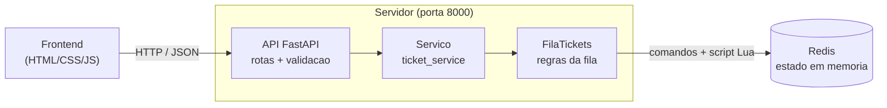

# support-ticket-hub

Sistema distribuído de fila de chamados de suporte técnico.

## Enunciado

[Equipe 13] — Sistema de Tickets de Suporte Técnico (Sugestão: Sockets / BullMQ com
Redis / RabbitMQ ou equivalente)
● Modelar a fila sequencial de chamados em memória em ordem de prioridade de chegada (FIFO), com campos: {ticket_id, usuario, descricao, status, timestamp_abertura}.
● Definir o design do protocolo textual separando permissões: perfil Usuário (pode abrir chamado) e perfil Técnico (pode consumir/fechar chamado).
● Escrever as validações conceituais de exclusividade: garantir que um chamado marcado como "em atendimento" não possa ser atribuído a um segundo técnico simultaneamente.
● Configurar a escuta TCP/fila com o framework escolhido (BullMQ+Redis, RabbitMQ ou equivalente) e testar o enfileiramento básico de uma mensagem.
● Documentar no README: estrutura da fila, diferenciação de perfis, tecnologia escolhida e justificativa.

## Tecnologias escolhidas

- **FastAPI**: servidor da aplicação e endpoints HTTP.
- **Redis**: armazenamento da fila de chamados.
- **Docker Compose**: execução dos serviços.
- **Frontend Web**: interface para usuários e técnicos.

## Justificativa tecnológica

A entrega pede um servidor rodando com um framework (não mais socket puro), um estado central
em memória e validações de formato. Cada escolha abaixo foi pensada pra encaixar nessas peças.

**FastAPI.** É um framework web de Python, então já cumpre o "não usar socket puro". A gente
escolheu ele porque define as rotas de forma enxuta e tipada, e a validação de entrada vem de
graça junto, pelo Pydantic. Isso atende direto o requisito de validações básicas de formato:
declarar que `usuario` e `descricao` são obrigatórios já faz o servidor recusar entrada inválida.
Além disso o FastAPI gera sozinho a documentação interativa (Swagger, em `/docs`), o que ajuda a
equipe a enxergar e testar o protocolo sem precisar de outra ferramenta. Como o time já trabalha
com Python, a curva de aprendizado é curta.

**Redis.** O ponto central da entrega é guardar o estado em memória, e o Redis é justamente um
banco em memória, então ele *é* esse estado central. O que pesou bastante é que as estruturas
dele casam com o nosso modelo sem precisar inventar nada: uma List dá a fila FIFO (`RPUSH` pra
entrar no fim, `LPOP` pra sair do começo), um Hash guarda os dados de cada chamado e Sets servem
de índice por status. E o mais importante: ele executa scripts Lua de forma atômica, o que
resolve a exclusividade exigida (dois técnicos nunca pegam o mesmo chamado) sem a gente ter que
implementar trava na mão. A sugestão do enunciado era BullMQ, que é do mundo Node; como o backend
é Python, usar o Redis direto entrega a mesma fila de um jeito mais simples pra nós.

**Docker Compose.** Sobe o backend e o Redis juntos com um comando só, sempre na porta fixada
(8000) e igual na máquina de todo mundo do grupo. Isso evita o clássico "na minha máquina
funciona" e ainda facilita rodar os testes dentro do container.

**Frontend em HTML, CSS e JavaScript puro (nesta entrega).** Como esta fase é de arquitetura e
escopo, o foco é o servidor, o estado e o protocolo; a tela entra como um complemento pra provar
que o contrato funciona de ponta a ponta. HTML puro não tem etapa de build, abre direto no
navegador e é rápido de mexer, o que é perfeito pra um esqueleto. Já dá pra exercitar o fluxo
inteiro (abrir, pegar e fechar chamado) sem montar um projeto de frontend completo.

**Next.js (próximas entregas).** Conforme o sistema crescer, manter a interface em HTML puro vai
ficando trabalhoso. O Next.js (em cima do React) traz componentização, roteamento e uma forma
mais organizada de lidar com estado, deixando a tela mais sustentável quando tiver mais fluxos.
Ele também facilita a atualização em tempo real (por exemplo via WebSocket, que já tem uma base no
backend) no lugar do polling que usamos agora. E essa troca é tranquila justamente por causa da
arquitetura: como o backend expõe uma API HTTP/JSON desacoplada da tela, dá pra começar simples
agora com HTML e migrar pro Next.js depois mexendo só no cliente, sem tocar no servidor.

## Arquitetura

O sistema é dividido em três partes: a interface web, o servidor da aplicação e o Redis,
que guarda o estado. O frontend nunca fala direto com o Redis; ele só conhece a API HTTP.
Quem traduz uma requisição em operações na fila é o backend, organizado em camadas.



### Elementos

- **Frontend (telas)**: HTML, CSS e JavaScript puro, sem framework. Tem a tela do usuário
  (abrir chamado) e a do técnico (pegar e fechar chamado, acompanhar a fila). Conversa com a
  API por HTTP trocando JSON e não acessa o Redis diretamente.
- **API FastAPI (porta 8000)**: é a porta de entrada. Recebe as requisições, valida o formato
  com Pydantic, separa os perfis (quais rotas o usuário e o técnico usam) e responde em JSON.
  Sobe na porta fixa 8000, com `/health` para teste e `/docs` com a documentação automática.
- **Camada de serviço (`ticket_service`)**: fica entre as rotas e a fila. As rotas não mexem
  no Redis direto, elas chamam o serviço, que chama a fila. Isso mantém a API desacoplada da
  implementação do armazenamento.
- **Fila (`FilaTickets`, em `queue/redis_queue.py`)**: onde mora a lógica da fila. Faz
  abrir/listar/pegar/fechar traduzindo para operações no Redis, garante a ordem FIFO e a
  exclusividade (um chamado nunca vai para dois técnicos) através de um script Lua atômico.
- **Redis**: o estado central em memória. Guarda a fila numa List, os dados de cada chamado
  num Hash e índices por status em Sets.

### Fluxo de uma requisição

- **Abrir** (usuário): `POST /tickets` → serviço → `FilaTickets.abrir` → o chamado entra no
  fim da fila (`RPUSH`) e seus dados vão para um Hash, com status `OPEN`.
- **Pegar** (técnico): `PATCH /tickets/next` → `FilaTickets.pegar` → um script Lua faz o
  `LPOP` e marca como `IN_PROGRESS` numa operação só, então dois técnicos nunca pegam o mesmo.
- **Fechar** (técnico): `PATCH /tickets/{id}/close` → `FilaTickets.fechar` → o chamado vira
  `CLOSED`.

O detalhamento da fila, dos perfis, do protocolo e da estratégia de concorrência está nas
seções abaixo.

## Como rodar

### Com Docker (mais fácil)

Com Docker e Docker Compose instalados, na raiz do projeto:

```bash
docker compose up --build
```

Isso sobe o Redis e o backend juntos. A API fica na porta fixa **8000**: dá pra testar em
`http://127.0.0.1:8000/health` e ver todos os endpoints em `http://127.0.0.1:8000/docs`.
Para parar, use `docker compose down`.

### Sem Docker

Também dá pra rodar o backend direto, num ambiente virtual. Nesse caso é preciso ter um Redis
no ar, porque a API conecta nele assim que inicia (a forma mais simples é subir só o Redis com
`docker compose up -d redis`).

No Linux ou macOS:

```bash
cd backend
python3 -m venv .venv
source .venv/bin/activate
pip install -r requirements.txt
uvicorn app.main:app --reload
```

No Windows (PowerShell):

```powershell
cd backend
python -m venv .venv
.venv\Scripts\Activate.ps1
pip install -r requirements.txt
uvicorn app.main:app --reload
```

O servidor sobe em `http://127.0.0.1:8000`, com `/health` para teste e `/docs` com a
documentação interativa.

### Frontend

As telas ficam na pasta `frontend/` e são HTML, CSS e JavaScript puro, sem framework e sem
etapa de build. Com o backend no ar, basta abrir `frontend/index.html` no navegador. Se o
navegador travar algo por estar abrindo via `file://`, sirva a pasta como site estático:

```bash
cd frontend
python -m http.server 3000
```

e acesse `http://localhost:3000`.

São três arquivos:

- **`index.html`**: página única com as duas áreas (usuário e técnico) juntas, boa pra testar o
  fluxo inteiro.
- **`usuario.html`**: só a parte do usuário, que abre chamado.
- **`tecnico.html`**: só a parte do técnico, que pega e fecha chamado e acompanha a fila.

Toda a comunicação é por HTTP/JSON com a API em `http://127.0.0.1:8000` (o backend libera CORS,
por isso as telas funcionam até abrindo o arquivo direto). A fila de chamados abertos se atualiza
sozinha a cada 3 segundos (um `GET /tickets` em loop). Os chamados que o técnico está atendendo
ficam salvos no `localStorage` do navegador, então recarregar a página não perde o que estava em
atendimento naquela aba — mas a fonte da verdade é sempre o Redis, no backend.

Isso aqui é o esqueleto da Entrega 1: servidor respondendo na porta certa, fila enfileirando e
o frontend já consumindo a API. Os refinamentos vêm nas próximas entregas.

## Demonstração

Os prints abaixo foram tirados com o sistema rodando (backend e Redis no Docker, e o frontend
servido localmente).

### Tela do usuário — abrir chamado


O usuário informa o nome e a descrição do problema e clica em "Abrir Chamado". Isso dispara um
`POST /tickets` e o chamado entra no fim da fila com status `OPEN`.

### Página única (usuário + técnico)


A `index.html` junta as duas áreas numa tela só, boa pra testar o fluxo inteiro. A fila de
chamados abertos, à direita, se atualiza sozinha a cada 3 segundos (`GET /tickets`).

### Tela do técnico — fila de chamados


O técnico vê os chamados em ordem de chegada. Ao clicar em "Pegar Próximo Chamado", o primeiro
da fila é atribuído a ele através de `PATCH /tickets/next`.

### Tela do técnico — chamados em atendimento


Cada chamado que o técnico pega vira um card próprio, com seu botão "Fechar Chamado"
(`PATCH /tickets/{id}/close`). Dá pra ter vários em atendimento ao mesmo tempo, refletindo o
que o backend permite (vários `IN_PROGRESS`).

### Documentação automática da API (Swagger)


O FastAPI gera essa documentação interativa em `http://127.0.0.1:8000/docs`. Ela lista todos os
endpoints e os schemas de entrada e saída (`TicketCreate`, `TicketAssign`, `TicketResponse`) e
ainda dá pra testar as rotas direto por ali.

## Estrutura de pastas

```
support-ticket-hub/
├── backend/              # API FastAPI + fila no Redis
│   ├── app/
│   │   ├── main.py       # sobe o servidor e registra as rotas
│   │   ├── api/          # rotas HTTP (tickets)
│   │   ├── schemas/      # validação de entrada/saída (Pydantic)
│   │   ├── services/     # camada entre as rotas e a fila
│   │   ├── queue/        # FilaTickets, implementação em cima do Redis
│   │   ├── core/         # configuração (host/porta do Redis)
│   │   └── websocket/    # base de WebSocket (uso futuro)
│   ├── tests/
│   ├── Dockerfile
│   └── requirements.txt
├── frontend/             # telas HTML do usuário e do técnico
├── docs/
│   ├── img/              # prints das telas usados neste README
│   ├── Contrato.md       # protocolo (também descrito aqui no README)
│   └── Arquitetura.md    # arquitetura (também descrita aqui no README)
├── docker-compose.yml
└── README.md
```

## Validações básicas

A entrada é validada já na borda da API, pelos schemas do Pydantic em `backend/app/schemas`.
`usuario` e `descricao` são obrigatórios e não podem ser vazios nem só espaços (passam por
`strip()`). Se o corpo da requisição vier errado, o servidor responde `422` apontando o campo.
Além disso, fechar um chamado só funciona se ele estiver em atendimento, senão retorna erro.

## Estrutura da fila no Redis

A fila é guardada inteiramente no Redis. A ordem de chegada (FIFO) é mantida por uma
lista, e cada chamado em si fica num hash separado. Além disso temos dois sets que
funcionam como índice para saber rapidamente quais tickets estão em atendimento ou já
fechados. Os campos exigidos pelo enunciado (`ticket_id`, `usuario`, `descricao`,
`status`, `timestamp_abertura`) ficam todos no hash do ticket.

| Chave | Tipo | Função |
|---|---|---|
| `tickets:pending` | List | Fila FIFO com os ticket_ids aguardando atendimento, na ordem de chegada |
| `ticket:<id>` | Hash | Dados do chamado (ticket_id, usuario, descricao, status, timestamp_abertura, etc.) |
| `tickets:in_progress` | Set | Índice dos chamados que algum técnico já pegou |
| `tickets:closed` | Set | Índice dos chamados encerrados |

O status de um chamado passa por três valores ao longo da vida dele: `OPEN` (acabou de
ser aberto e está na fila), `IN_PROGRESS` (um técnico pegou) e `CLOSED` (foi fechado).

## Perfis e permissões

Separamos quem pode fazer o quê em dois perfis. O **Usuário** só consegue abrir chamado.
O **Técnico** é quem consome a fila: pega o próximo da vez e depois fecha. Listar os
chamados abertos qualquer um pode fazer, já que é só leitura.

| Perfil | O que pode fazer |
|---|---|
| Usuário | Abrir chamado (`POST /tickets`) |
| Técnico | Pegar o próximo da fila (`PATCH /tickets/next`) e fechar um chamado (`PATCH /tickets/{id}/close`) |
| Qualquer | Listar os chamados abertos (`GET /tickets`) |

## Estratégia de concorrência

O ponto mais delicado é garantir que dois técnicos não peguem o mesmo chamado ao mesmo
tempo. Para isso o método `pegar` não faz a retirada em vários passos no Python, e sim
através de um script Lua que roda dentro do próprio Redis. Enquanto esse script executa,
o Redis não deixa nenhuma outra operação acontecer, então a sequência "tira o primeiro
da fila e marca como em atendimento" vira uma coisa indivisível. Mesmo que duas
requisições cheguem no mesmo instante, uma vai pegar o chamado e a outra vai pegar o
próximo (ou nenhum, se a fila esvaziar).

## Protocolo de comunicação

A comunicação é toda por HTTP, trocando JSON nos dois sentidos. O servidor sobe na porta 8000,
então a base das URLs é `http://127.0.0.1:8000`. A separação de perfis aparece no protocolo: o
usuário só abre chamado e o técnico consome a fila (pega e fecha).

### Formato do chamado (TicketResponse)

Toda resposta que devolve um chamado usa o mesmo formato:

| Campo | Descrição |
|---|---|
| `ticket_id` | identificador único do chamado (gerado pelo servidor) |
| `usuario` | quem abriu |
| `descricao` | texto do problema |
| `status` | `OPEN`, `IN_PROGRESS` ou `CLOSED` |
| `timestamp_abertura` | data/hora de abertura (ISO 8601, UTC) |
| `tecnico` | técnico que pegou (vazio enquanto ninguém pegou) |
| `timestamp_atendimento` | quando o técnico pegou (vazio antes disso) |
| `timestamp_fechamento` | quando foi fechado (vazio antes disso) |

### Rotas

**`POST /tickets`** — abrir chamado (perfil Usuário)

Corpo: `{ "usuario": "joao", "descricao": "Notebook nao liga" }`

Resposta `201 Created` com o ticket recém-criado (status `OPEN`). Os dois campos são
obrigatórios; o servidor faz `strip()` e recusa string vazia ou só com espaços (responde `422`
apontando o campo).

```json
{
  "ticket_id": "8f3c1b2a-...",
  "usuario": "joao",
  "descricao": "Notebook nao liga",
  "status": "OPEN",
  "timestamp_abertura": "2026-06-14T18:20:00+00:00",
  "tecnico": "",
  "timestamp_atendimento": "",
  "timestamp_fechamento": ""
}
```

**`GET /tickets`** — listar chamados abertos (qualquer perfil)

Resposta `200 OK` com a lista de chamados em status `OPEN`, na ordem de chegada. Se não houver
nenhum, devolve `[]`.

**`PATCH /tickets/next`** — pegar o próximo (perfil Técnico)

Corpo: `{ "tecnico": "maria" }`

Pega o primeiro da fila, marca como `IN_PROGRESS` e devolve `200 OK` com o ticket. Se a fila
estiver vazia, responde `404 Not Found`. Essa é a operação crítica da exclusividade: a retirada é
atômica no Redis (script Lua), então dois técnicos nunca recebem o mesmo chamado.

**`PATCH /tickets/{ticket_id}/close`** — fechar (perfil Técnico)

Fecha um chamado que está em atendimento. Resposta `200 OK`:

```json
{ "ticket_id": "8f3c1b2a-...", "status": "CLOSED" }
```

Se o ticket não existir ou não estiver em atendimento, responde `400 Bad Request`.

**`GET /health`** — serve só para testar se o servidor está no ar. Responde `{ "status": "ok" }`.

### Exemplo de uso (curl)

```bash
# usuario abre um chamado
curl -X POST http://127.0.0.1:8000/tickets \
  -H "Content-Type: application/json" \
  -d '{"usuario": "joao", "descricao": "Notebook nao liga"}'

# tecnico pega o proximo da fila
curl -X PATCH http://127.0.0.1:8000/tickets/next \
  -H "Content-Type: application/json" \
  -d '{"tecnico": "maria"}'

# tecnico fecha (use o ticket_id retornado acima)
curl -X PATCH http://127.0.0.1:8000/tickets/<ticket_id>/close
```

### Códigos de resposta

| Situação | Código |
|---|---|
| Chamado aberto com sucesso | 201 |
| Listagem, pegar ou fechar com sucesso | 200 |
| Fila vazia ao tentar pegar o próximo | 404 |
| Fechar um ticket inexistente ou que não está em atendimento | 400 |
| Corpo inválido (campo obrigatório faltando ou vazio) | 422 |

## Testes

Os testes ficam em `backend/tests` e usam o pytest. O `test_fila.py` cobre o enfileiramento
básico: abrir um chamado coloca ele na fila com os campos exigidos, e a ordem respeitada é a de
chegada (FIFO). Eles precisam de um Redis acessível; se não houver nenhum, são pulados em vez de
falhar.

Com o stack do Docker no ar:

```bash
docker compose exec backend pytest -v
```

Ou localmente, com o ambiente virtual ativado e um Redis rodando:

```bash
cd backend
pytest -v
```